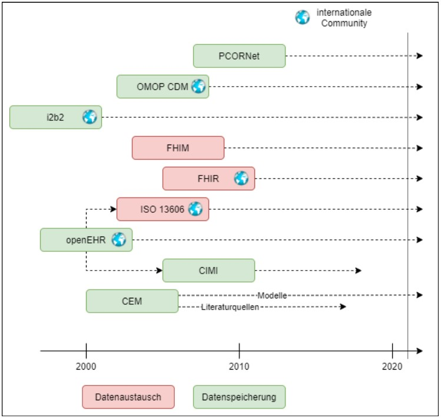

# What is OpenEHR?

> "'openEHR' is the name of a technology for e-health, consisting of open specifications, clinical models and software that can be used to create standards, and build information and interoperability solutions for healthcare. The various artefacts of openEHR are produced by the openEHR community and managed by openEHR International, an international non-profit organisation originally established in 2003 and previously managed by the openEHR Foundation." - [openEHR.org](https://www.openehr.org/about/what_is_openehr)

In the context of health the availability and usefulness of data is a decisive success factor. This applies to the individual whose data is used for their treatment and also for the society that has a need of scientific progress as well as cost efficiency in the health sector. With the rising amount of data created in research and treatment not only the IT Hardware had to develop but even more the need of optimized data storage, models and overall data processing processes arised.

There are different approaches to dealing with interoperability and exchangeability of data. I.e. FHIR which is more Exchange-oriented or openEHR which is more model-oriented but can also be used for exchange of data. See the figure below to get an overview about some of the different approaches and the timeline of their development.

(own figure - Mareike Joseph(MHH 2022) )

Further details about how the openEHR Framework works, how it is developed and what it is based on can be found in later chapters (see [OpenEHR-Details](../platform/openehr_details.md)).

---
