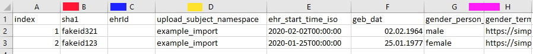
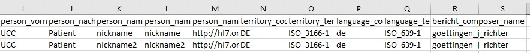
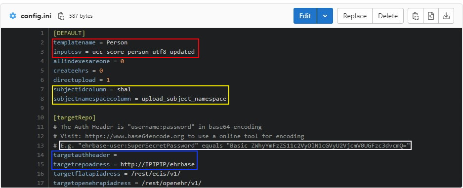
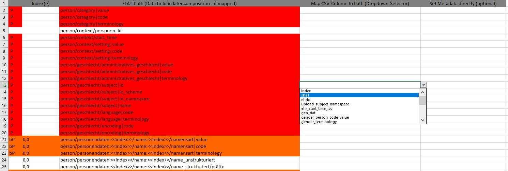

# Flat_Loader - Example
On this page we want to give an comprehensive example on how to use the FLAT-Loader to transform data successfully. The main aspects of the import process are:

- [Data Preparation](#data-preparation)
  - Data Curation
  - Data Formatting
- [Configuration](#configuration)
- [Mapping](#mapping)

## Test the following example
You can find the [FLAT-Loader](https://gitlab.gwdg.de/medinfpub/openehr_flat_loader) and the [files used in the following example](https://gitlab.gwdg.de/medinfpub/openehr_flat_loader/-/tree/master/HowTo/FLAT_Loader_Testcase_Person) in Gitlab.

## Data Preparation
There are some noteworthy aspects in preparing the data to be consumed by the FLAT_Loader. Aligning **data types** and **item/column names** and **some metadata** with the **data model / openEHR-Template** makes the transformation process easy.

#### Data Curation
Curate your data and make sure to only generate (and upload) data with high data quality that matches your needs and the needs of others working with the data in the future.

#### Data Formatting
The data formatting has to comply on one hand with constraints in the data model (e.g. Date and Time formatting according to standards defined in openEHR) and on the other hand with constraints of the FLAT_Loader (e.g. Id-Column name, metadata like language, status codes and encoding info to build valid resources). 

Example of a [CSV-File](https://gitlab.gwdg.de/medinfpub/openehr_flat_loader/-/blob/master/HowTo/FLAT_Loader_Testcase_Person/Input/CSV/ucc_score_person_utf8_updated.csv) that will be mapped onto a _Person_-Template:

- Note the column _sha1_(red), _ehrId_(blue) and _upload_subject_namespace_(yellow) which contain metadata relevant for the configuration of the FLAT-Loader.
- Note column H (_gender_terminology_(pink)) that contains a link to a Terminology Definition in Simplifier. The codes from this terminology are then used in column G (_gender_person_(pink)). Also note that in this case the display value of the code is identical with the code itself (female = "female") therefore a third column aka _gender_display_ is not needed.

#### Note on Data Privacy
When working with medical data (this includes transforming or uploading the data to some repository) make sure you act wihthin the consent that is connected with the data and make sure you have all rights to upload the data and inform yourself about the safety and acccessability of the network you are communicating in.

## Creating a Mapping, Building Resources and Uploading Compositions
The general process has been already shown in the [BPMN-Process Figure](../flat_loader.md#tool-usage-steps). 

See the following example to test the tool yourself:

#### Configuration
The [_config.ini_-File](https://gitlab.gwdg.de/medinfpub/openehr_flat_loader/-/blob/master/HowTo/FLAT_Loader_Testcase_Person/config.ini) contains some attributes relevant for the FLAT-Loader.

Place the files in the respective folders (.opt in OPTs, .csv in ETLProcess/Input/).
- RED Rectangle:  
_templatename_ and _inputcsv_ are used to define the name of the CSV-File and the Template (OPT) that will be used.
- YELLOW Rectangle:  
Define the column-names that contain the subjectID (sha1 in this example) and SubjectNamespace (upload_subject_namespace in this example)
- BLUE Rectangle:
For upload purposes define the adress of the openEHR-Repository as _targetrepoadress_. Supply the authenthication information as base64 encoded _targetauthheader_ (see an example in the white rectangle)

#### Mapping
With the aboved described information and files in place you can start the tool.

1. Upload OPT and Download WebTemplate + Example Composition
>  - Start the Step0-Batch-File to perform these step.
>  - The files will be stored in _ETLProcess/ManualTasks/:Template_Name:/_
2. Generate a Mapping File using the Column-Names of the CSV and the FLAT-Paths extracted from the Webtemplate by starting the Step2-Batch File.
>  - For elements that are repeatable (can occur x times in the template) you need to give a number to define the amount of FLAT-Paths that are generated in the mapping. 
  (I.e. if you are asked to provide info about how often the element "person/name" will be present, you might set it to "2" so you will have the path 2 times: "person/name:0" and "person/name:1" to map information to. To avoid this you can set all indexes to 1 in _config.ini_ and adapt the number and indexes of paths manually in the later mapping file.)
  > - The generated mapping file will be located in _ETLProcess/ManualTasks/:Template_Name:/_.
3. Fill out the Mapping by opening the Excel-File and select a CSV-Column Name to map (for the example see the already [filled mapping supllied in HowTo-Folder](https://gitlab.gwdg.de/medinfpub/openehr_flat_loader/-/blob/master/HowTo/FLAT_Loader_Testcase_Person/ManualTasks/Person_MAPPING.xlsx)).

> - Mandatory fields are marked with red. Conditonally mandatory fields are marked in orange. This might differ for different servers. If you are missing a mandatory attribute in your mapping/later composition the server will return an error message with hints about the missing attribute. Use the Compositions generated in the Output-Folder to test this.
> - To generate Compositions using the Mapping start the Step3-Batch File.
> - The generated Resources/Compositions are located in _ETLProcess/Output_. You may try uploading those manually via CURL/Postman or the REST-Client of your choice to develop and test your mapping. You can turn the direct upload via the FLAT_Loader on/off in the config file.
> - The generation of ehrIds is only needed if the csv-file has no valid IDs stored in he ehrId-Column.

With these steps you are prepared to preapre your data, generate and fill out a mapping file as well as communicating the results with the server/openEHR-Repository.

---
