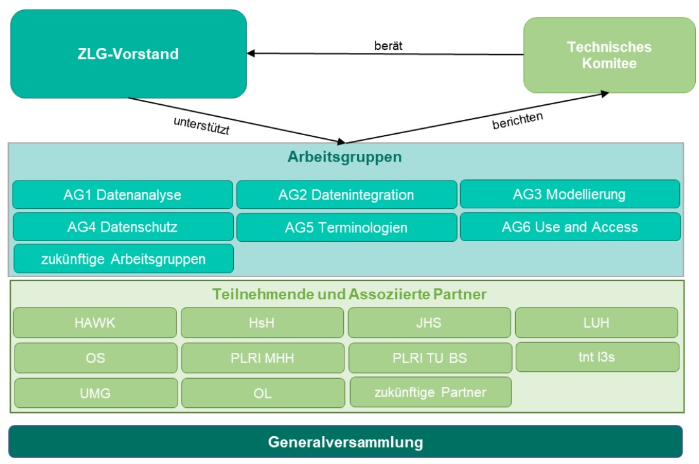

# Governance

A governance framework organizes the relevant processes required to operate and use a shared and distributed platform for medical data. The governance framework provides the regulatory framework for the processes taking place within the platform.

Due to the uniqueness of research projects, institutions and local regulation every research platform provider has to adapt hiw own governance structure. Nevertheless there are some aspects that can be adopted. For this reason we present a short overview of the governance strcuture of the Zukunftslabor Gesundheit.

The governance structure of the Future Lab consists of the following components: 

Most noticable here are the __Use and Access Comittee / Work Group__ that cares for the handling of ethic and regulatory matters when researcher want access to data.  

Also the joint work of __Data Integration Groups__ and __Modelling Groups__ is a core aspect of openEHR base platforms.

Further information can be found in publications of the __Zukunftslabor Gesundheit__ or the __[HiGHmed Consortium](https://www.highmed.org/en/highmed-governance-bodies)__ which also worked on openEHR and platform governance.

---
