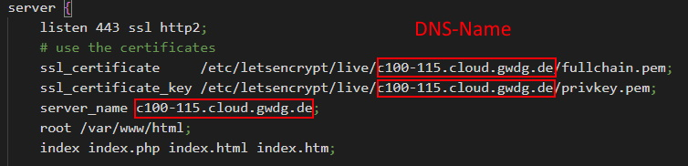

# Security

## Assess context and security needs
The security of data repository and associated tools depends on the (network) environment, accessibility and governance. If you plan to have your CDR in a secure network without any connection to the internet and only access by a small set of people you will not need to worry about mouch. However if you make your repository and your data more accessible you will have to give a thought to security aspects.

## Governance and Access
Together with the government concept you have to define access scenarios, regulations and user roles with suitable access rights. This takes effect mainly in governance processes and for example role based access via keycloak.

## Simple SSL-Security
The NUM-Portal as well as the EHRBase are often exposed to the internet. The traffic of these tools is not encrypted by default. Setting up an NGINX as a Proxy in front of these services and activating SSL-Encryption is an easy way to get a more secure environment.

The FLAT_Loader is a tool that runs locally and performs only data transformation before sending the data to an openEHR-Repository.

### Setting up multiple service with nginx proxy
1. Clone the "zlg-platform" repository from [Gitlab](https://gitlab.gwdg.de/medinf/ivf/zukunftslabor-gesundheit/zlg-platform). You will find a docker-compose file including all services in the main-folder. To start services individually see docker-compose files inside the folders of the services.

2. Start the services you want i.e.
> `docker-compose up -d ehrbase`
> `docker-compose up -d mdbook`

3. Set the "nginx.conf" to "before-cert-creation.conf" by  
> `cp ./nginx/before-cert-creation.conf ./nginx/nginx.conf`

4. Start the nginx service via docker-compose by  
> `docker-compose up -d --force-recreate nginx`  
Make sure port 80 and 443 are open on your machine.

5. Set your domain for the certificate and email for notification about certification renewals in the docker-compose
> `nano docker-compose.yml`

> Adapt the following line:  
> `command: certonly --webroot -w /var/www/certbot --force-renewal --email {email} -d {domain} --agree-tos`

6. With nginx running retrieve the certificates for your domain by starting the certbot-container  
> `docker-compose up -d certbot`

7. Set your DNS-Name / Domain (not the ip) in the after-cert-creation.conf-file. 
> 

8. Now configure HTTPS in Nginx by using the after-cert-creation.conf by
> `cp ./nginx/after-cert-creation.conf ./nginx/nginx.conf`

9. After that restart the nginx for the changes to take effect
> `docker-compose up -d --force-recreate nginx`

Your services will be available via your DNS-Name and the service endpoint (i.e. /ehrbase).

You may setup a crontab to regularly renew the certificate. See [this explanation](https://www.programonaut.com/setup-ssl-with-docker-nginx-and-lets-encrypt/) (about SSL and crontab) or [this one](https://mindsers.blog/post/https-using-nginx-certbot-docker/) (about SSL with NGINX) for further details.

---
