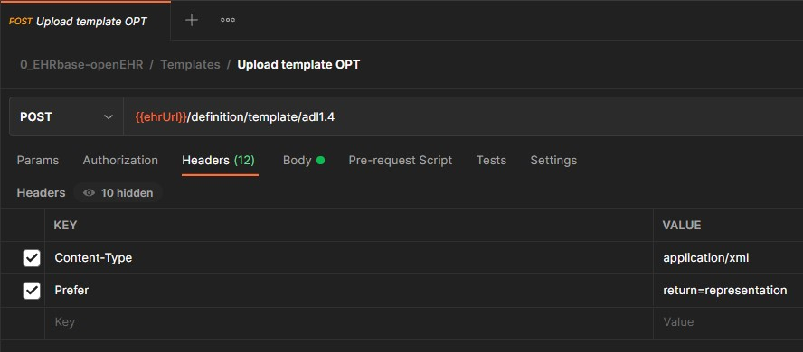

# Upload Templates

For an openEHR-Repository to be able to store Data / Composition it is needeed to upload the Template to the Repository. Templates need to be saved in Operational Template Format (.opt-File) which is an Export-Format in the [CKM](https://ckm.openehr.org/ckm/). 

#### REST-Call in Postman:

> `ehrUrl = `{{baseURL}}/rest/openehr/v1

> `Body = ` Operational Template (OPT) in XML (or JSON) Format

#### Pitfalls

- **Special Characters in Template-Names**  
Template-Names should not contain special-characters like "/". This may lead to the file-name being different than the original Template-Name in some tools (e.g. after downloading the template from the CKM).
- **Numbers as First-Character in Template-Names**  
Some tools (e.g. openEHR-SDK) are baseed on Java. If for some reason java classes are generated for the Template these cannot have a number as a first character. So better avoid this when naming Templates.

---
