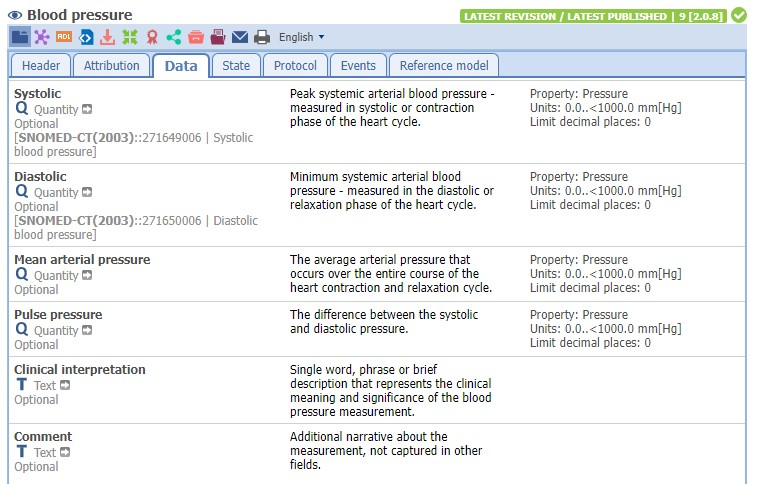
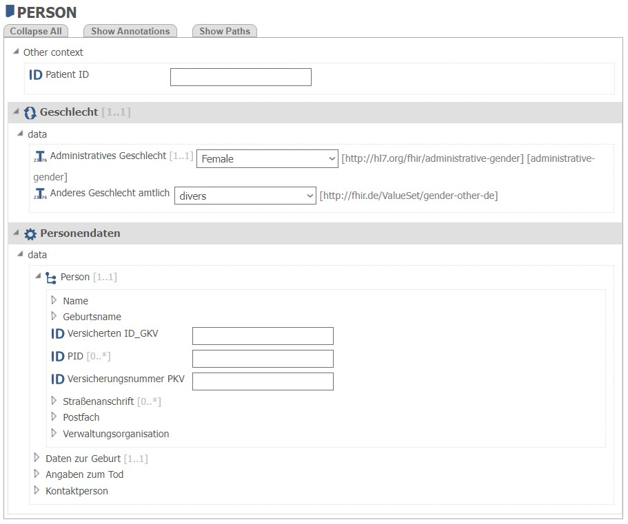

# Modelling and Reviews

Tied to the community aspect of openEHR development the modelling process in openEHR relies on interprofessional exchange and participation. The center of modelling processes is the [Clinical Knowledge Manager (CKM)](https://ckm.openehr.org/ckm/). 

It is used to upload modelling artefacts that were produced using modelling tools. A list of modelling tools can be found at [openEHR.org](https://www.openehr.org/products_tools/modelling_tools/).

I.e. 
- [Better Archetype Designer](https://tools.openehr.org/designer/#/)
- [Ocean´s Template Designer](http://downloads.oceaninformatics.com/downloads/TemplateDesigner/)

> It is possible to setup your own CKM for your project/institution but make sure to contribute to the (inter-)national interopability establishing efforts.

## Modelling Archetypes
An archetype defines a maximum set of attributes for a specific concept. For personal use these archetypes can be constrained in templates.

An easy example is blood pressure:

Reusing existing archetypes and communicating needed changes with the community is best practice. Generating new archetypes for own use purposes because of small changes is bad practice and may hinder interoperability in the long run.

The definition and revision of new archetypes or changes can be a long and tedious process but is needed to make openEHR a well established modelling framework.

## Modelling Templates
Templates describe a data set with attributes, term sets and other constraints. Exported as an Operational Template they are used by the server to be able to store instances of data entries in the form of the template.

Here we saw a part of a template to capture person data:

The cluster of data (i.e. Name) hold different attributes and originate from a specific archetype that was included in the template. Via the "Show Paths"-Button you are able to see the AQL-Paths that are used for storing and querying the data to the specific attribute in the openEHR-Repository.

## Reviews
To publish archetypes and reviews as well as to support the modelling process the CKM supports peer-reviews. The Feature allows modellers/creators to start a review and invite persons that are registered in the CKM to participate.

It is possible to state specific question about different attributes and reviewers have the possiblity to comment on every aspect of the uploaded artefact.

The review process is a core element of openEHR´s modelling and assuring quality of the artefacts that will later be used in production. Artefacts can be exported from CKM and uploaded to an openEHR-Repository which will be described on the next pages.

---
